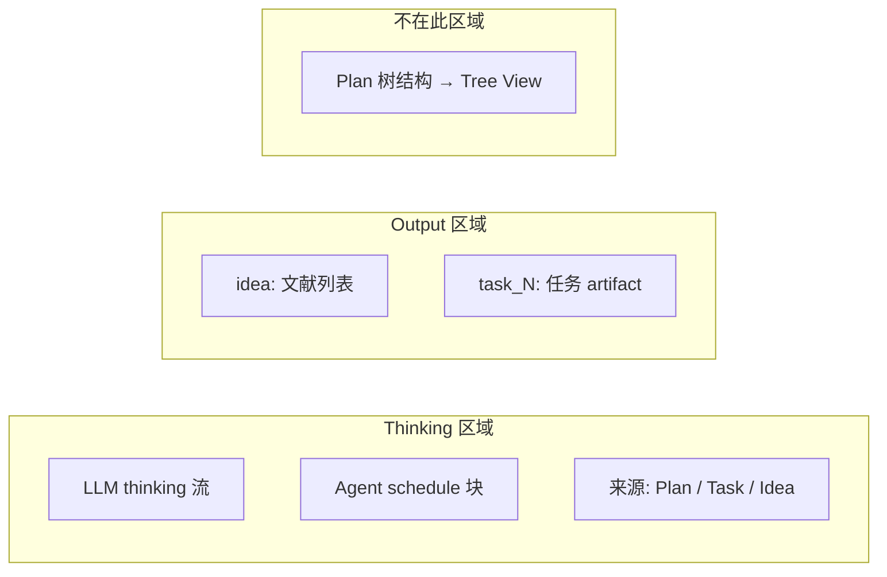
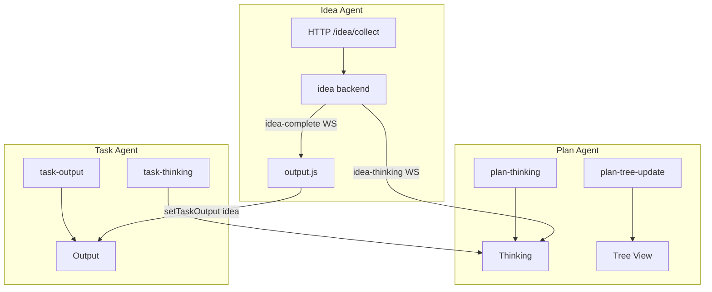

# Thinking / Output 区域职责规划

本文档定义 MAARS 前端 **Thinking** 与 **Output** 两区域的职责边界、数据模型及三个 Agent 的划分规范。

## 一、区域职责定义

### 1.1 Thinking 区域

**职责**：展示 AI 的推理过程（reasoning），不包含最终产出。

| 内容类型 | 来源 | 展示形式 |
|----------|------|----------|
| LLM thinking | Plan/Task/Idea LLM 模式的 `content` 流 | Markdown 块 |
| Agent thinking | Plan/Task Agent 模式的 `content` | 同上 |
| 调度信息 | Agent 模式的 `scheduleInfo` | Schedule 块（turn、tool_name、tool_args_preview） |

**来源标识**：每个 block 带 `source`（Plan / Task / Idea）和可选的 `taskId`、`operation`。

**不展示**：最终产出（树结构、任务 artifact、文献列表等）。

详细设计见 [Thinking 区域设计说明](thinking-area-design.md)。

### 1.2 Output 区域

**职责**：展示各 Agent 的最终产出（artifact），不包含推理过程。

| 来源 | 产出类型 | Key 规范 |
|------|----------|----------|
| Idea Agent | 文献列表（keywords + papers） | `idea` |
| Plan Agent | 任务树结构 | 不进入 Output，由 Tree View 承载 |
| Task Agent | 各任务的 artifact（JSON/Markdown） | `task_{task_id}`，如 `task_1` |

**不展示**：推理过程、中间状态、调度信息。

### 1.3 职责边界总结



| 区域 | 展示内容 | 不展示 |
|------|----------|--------|
| **Thinking** | 推理过程（thinking + schedule） | 最终产出 |
| **Output** | 最终产出（idea 文献、task artifact） | 推理过程、树结构 |

## 二、三个 Agent 的划分

### 2.1 数据流概览



### 2.2 各 Agent 说明

| Agent | Thinking 来源 | Output 去向 |
|-------|---------------|-------------|
| **Plan Agent** | `plan-thinking`（WebSocket） | 树结构 → Decomposition / Execution 视图 |
| **Task Agent** | `task-thinking`（WebSocket） | `task-output` → Output 区域 |
| **Idea Agent** | `idea-thinking`（WebSocket，关键词提取阶段） | `idea-complete`（WebSocket）→ `setTaskOutput('idea', ...)` |

### 2.3 两种推理过程

依据 API 通信类型，推理过程分为两种：

| 类型 | 说明 | Thinking 展示 |
|------|------|---------------|
| **LLM 推理** | 单轮 LLM 调用 | 仅展示 LLM 的 thinking 内容（chunk） |
| **Agent 推理** | ReAct 多轮 Agent | 展示 thinking 内容 + 调度信息（schedule blocks） |

Idea Agent 为 LLM 推理，无 scheduleInfo；Plan/Task 在 Agent 模式下有 scheduleInfo。

## 三、数据模型与 API 约定

### 3.1 Thinking 事件统一格式

```typescript
// WebSocket: plan-thinking, task-thinking, idea-thinking
interface ThinkingPayload {
  chunk: string;           // 推理内容，空字符串时仅表示调度
  source: 'plan' | 'task' | 'idea';  // 明确来源
  taskId?: string;        // Task 时必填；Plan/Idea 为 null
  operation?: string;     // 如 Plan, Execute, Keywords, Refine, Atomicity, Decompose, Validate
  scheduleInfo?: {        // Agent 模式可选（Idea 无 scheduleInfo）
    turn?: number;
    max_turns?: number;
    tool_name?: string;
    tool_args_preview?: string;
  };
}
```

### 3.2 Output 事件统一格式

```typescript
// WebSocket: task-output
// 或前端直接写入（如 Idea Agent）
interface OutputPayload {
  source: 'idea' | 'task';
  key: string;            // 'idea' | 'task_1' | 'task_2' ...
  output: string | { content?: string; label?: string; ... };
  label?: string;         // 展示用，如 "Task 1", "Refine"
}
```

### 3.3 Key 规范

| source | key 格式 | 示例 |
|--------|----------|------|
| idea | `idea` | 固定 |
| task | `task_{task_id}` | `task_1`, `task_2` |

废弃 `refine`，统一为 `idea`。

## 四、实现要点

### 4.1 后端

| 文件 | 改动 |
|------|------|
| `api/routes/plan.py` | `on_thinking` payload 增加 `source: 'plan'` |
| `task_agent/runner.py` | `task-thinking` 增加 `source: 'task'` |
| `idea_agent` | 流式 `extract_keywords_stream`，`collect_literature(on_thinking)`，路由 emit `idea-thinking` |

### 4.2 前端

| 文件 | 改动 |
|------|------|
| `thinking.js` | 支持 `source` 字段；无 `source` 时按 `taskId` 推断 |
| `plan.js` | `setTaskOutput('idea', ...)` 替代 `'refine'`；Refine 前确保 WS 连接 |
| `websocket.js` | 新增 `idea-thinking` 监听，透传 `source` |

### 4.3 实现细节

- **Clear 策略**：Refine 点击清空所有区域（Idea Agent 不创建 plan）；Plan 点击清空所有区域并创建新 plan；Execute 点击清空 Thinking、任务状态与 Output，相当于重新执行
- **Output 排序**：按 `source` 分组，idea 置顶，task 按 task_id 排序
- **Header 文案**：Thinking block 使用 Plan / Execute / Refine，对应前端按钮
- **Plan 全流式**：atomicity、quality 也使用 `stream=True`，统一展示 thinking
- **Idea Mock**：与 Plan 对齐，从 `test/mock-ai/refine.json` 加载，使用 `mock_chat_completion` 流式输出

## 五、迁移注意点

1. **向后兼容**：旧 payload 无 `source` 时，前端按 `taskId` 推断
2. **`refine` → `idea`**：统一 key，旧 session 的 `refine` 可迁移或忽略
3. **Idea 推理**：改为真实流式；Mock 模式与 Plan 对齐，从 mock-ai/refine.json 加载，使用 mock_chat_completion 流式输出
