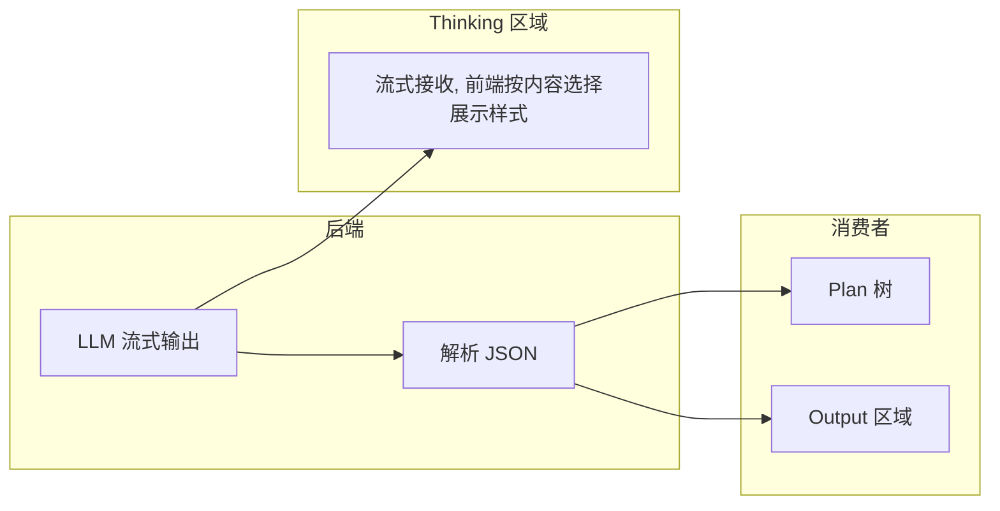

# Thinking 区域设计说明

本文档描述 MAARS **Thinking 区域**的设计思路、展示逻辑及与后端的数据流约定。

## 一、设计思路

### 1.1 核心原则

Thinking 区域只负责展示 **AI 推理过程**，不展示最终产出。所有块统一为 **thinking 块结构**（header + 可选 body）：

| 有 thinking | 无 thinking |
|-------------|-------------|
| header + body（推理内容） | header only（body 隐藏） |

「无 thinking」时 JSON 被树和 Output 消费，但 **header 仍展示**（source、operation、taskId、turn、tool_name 等），与有内容块使用同一 header 格式。

「无 thinking」包括：
- **调度信息**：Agent 模式的 turn、tool_name 等
- **纯 JSON**：LLM 直接输出 JSON、无推理文本（如 Plan 的 decompose/atomicity 结果）

### 1.2 JSON 流向

JSON 串由 **树** 和 **Output** 区域消费。Thinking 区域收到完整流式输出后，由前端判断：有 thinking 则展示，纯 JSON 则用 schedule 样式。



## 二、展示逻辑

### 2.1 统一结构

所有块均为 **thinking 块**（header + 可选 body）：

| 条件 | 展示 |
|------|------|
| 有推理内容（非纯 JSON） | header + body（Markdown 渲染） |
| 无推理（调度信息或纯 JSON） | header only（body 隐藏） |

Header 格式统一：`source · operation · taskId · Turn N/M · tool_name(args)`，由 `_buildHeaderText(block)` 生成。

### 2.2 判断规则

- `blockType === 'schedule'` 或 `_isNoThinking(block)` → header-only（无 body）
- 否则 → header + body

## 三、后端职责

### 3.1 统一处理逻辑

所有 Agent（Idea、Plan、Task）采用同一逻辑：

| 模式 | 行为 |
|------|------|
| **LLM 单轮** | 流式调用 `chat_completion`，`on_chunk` 将 LLM 输出逐 token 转发到 `on_thinking` |
| **Agent 模式** | tool 调用时发 `on_thinking("", schedule_info={...})`，LLM 的 `content` 作为 thinking 发送 |

后端不做内容过滤：**完整流式输出**均发往 thinking。有 reasoning 则前端展示 thinking 块，纯 JSON 则前端用 schedule 样式渲染。

### 3.2 发送到 Thinking 的内容

| 场景 | 发送内容 |
|------|----------|
| LLM 流式输出 | `on_thinking(chunk, task_id, operation)`，chunk 为逐 token |
| Agent tool 调用 | `on_thinking("", schedule_info={turn, tool_name, ...})` |

### 3.3 JSON 流向

JSON 由后端解析后写入 `plan.json`、`idea.json`、task artifact，供树和 Output 消费。Thinking 区域仅负责展示，不参与 JSON 解析。

### 3.4 Prompt 约定

所有与 LLM 通信的 prompt 统一鼓励「先 reasoning，再输出」：

- **Idea**（Keywords、Refine）：`1. Reasoning ... This will be shown as your thinking process. 2. JSON ...`
- **Plan**（atomicity、decompose、format、quality）：`1. First, briefly explain your ... reasoning. This will be shown as your thinking process. 2. Then, output the JSON ...`
- **Task**（executor、validation）：`You may reason first; this will be shown as your thinking process. For JSON: output reasoning first, then the JSON ...`
- **Task Agent**：`You may reason first in your response; this will be shown as your thinking process.`

系统已设计为接收并展示 thinking，因此 prompt 应明确告知模型其推理会被展示，以鼓励输出。

## 四、前端实现要点

### 4.1 关键函数

| 函数 | 职责 |
|------|------|
| `_buildHeaderText(block)` | 构建 header 文案（调度信息与有内容块共用） |
| `_isNoThinking(block)` | 判断内容是否为纯 JSON（可解析） |
| `appendChunk(chunk, taskId, operation, scheduleInfo, source)` | 接收 WebSocket 数据，创建/更新 block |

### 4.2 appendChunk 分支

- `!chunk && scheduleInfo` → 创建 header-only 块（需 `tool_name` 或 `operation`），存储 taskId、operation、source
- 有 chunk → 创建或追加 thinking 块

### 4.3 渲染分支

- `isHeaderOnly`（schedule 块 或 纯 JSON 内容）→ 渲染 thinking 块，仅 header（`--header-only`）
- 否则 → 渲染 thinking 块（header + body）

## 五、数据流小结

```
WebSocket (plan/idea/task-thinking)
    → appendChunk
    → blocks[]（thinking 块）
    → renderThinking
    → 有 thinking：header + body
       无 thinking：header only（body 隐藏）
```

JSON 由后端解析后写入 `plan.json`、`idea.json`、task artifact，由树和 Output 区域消费，不参与 Thinking 展示。
